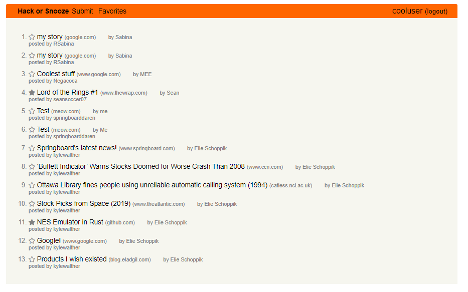

<!-- PROJECT INTRO -->
<div>
<h3 align="center">Hack or Snooze</h3>
  <p align="center">
    A front end social media app for sharing and favoriting news stories, using jQuery
  </p>
</div>



<!-- GETTING STARTED -->
### Getting Started

The main html file has all the scripts necessary for the app to run, and no API keys are needed. So, getting started is simple.

1. Clone the repo
   ```sh
   git clone https://github.com/kirra-hyde/news.git
   ```
2. Launch the server.  For instance:
   ```sh
   python3 -m http.server
   ```
   (Or however you are set up to launch front end servers.)

<!-- USAGE EXAMPLES -->
## Usage

Before creating an account, you can see stories others have shared.  After creating an account, you can share your own stories.  And you can favorite stories, and see the stories you have favorited.

<!-- ACKNOWLEDGMENTS -->
## Acknowledgments

Thanks to Michael Heuter, Elie Schoppik, and Joel Burton for planning the project and providing starter code!  (See the comment at the beginning of `index.html` for more detailed attribution.)
